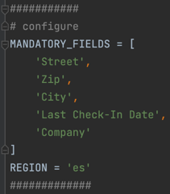
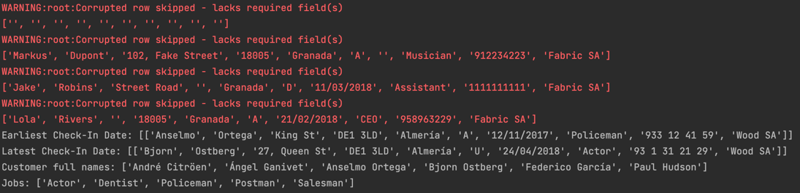

# Data analyzer

## Requirements
- conda 4.10.3

## How to run
    $ conda create --name <env> --file requirements.txt
    $ conda activate <env>
    $ python src/solution.py data/data.csv

## How to test
    $ pytest

# Important note
When solving this task I decided to focus on module functionality and
ability to quickly add new features
rather than on pure graphical interface. `solution.py` solves task, but
uses console only in order to represent
solution in a raw form that would normally be used in any other python
module.

## Configuration
There is possibility to configure mandatory fields (when data row in CSV file 
does not contain data there, it will be skipped) and language used for dates
and alphabet.

## Solution

## Task description

I want to analyze my Company data so that I could take advantage of this info and make more money for my company (this is a highly competitive sector). No DB usage is needed, we just need to read the csv file and show the results on the screen.

## Details

- Retrieve the customer with the earliest check in date.
- Retrieve the customer with the latest check in date.
- Retrieve a list of customer’s full names ordered alphabetically.
- Retrieve a list of the companies user’s jobs ordered alphabetically.
- File required fields are: Street, Zip, City, Last Check-in Date and CompanyCheck that every exception is handled accordingly

## Functional notes

- The file has the following headers: First Name, Last Name, Street, Zip, City, Type, Job, Phone, Last Check-In Date and Company.
- The full name of our customers is composed as First Name + Last Name.

## Technical notes

- The example file has 10 rows of data (excluding the header). But it needs to work with any file.
- It is recommended to log exceptions in case that a required field is empty for that row but the rest of the file is still processed.
- It is recommended to log an exception in case a row contains less fields than expected but the rest of the file is still processed.
- It is recommended to log an exception in case a row does not contain any data but the rest of the file is still processed.
